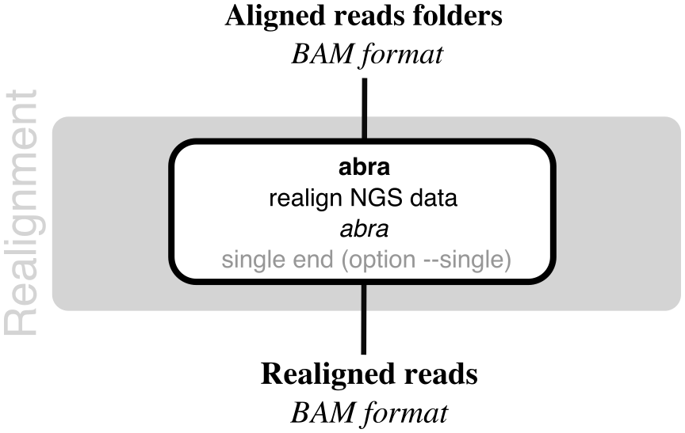

# abra-nf

## Nextflow pipeline for ABRA2 (Assembly Based ReAligner)



## Description

Apply [ABRA2](https://github.com/mozack/abra2) to realign next generation sequencing data using localized assembly in a set of BAM files.

This scripts takes a set of [BAM files](https://samtools.github.io/hts-specs/) (called `*.bam`) grouped folders as an input. There are two modes:
- When using matched tumor/normal pairs, the two samples of each pair are realigned together (see https://github.com/mozack/abra#somatic--mode). In this case the user has to provide as an input the folders containing tumor (`--tumor_bam_folder`) and normal BAM files (`--normal_bam_folder`) (it can be the same unique folder). The tumor bam file format must be (`sample` `suffix_tumor` `.bam`) with `suffix_tumor` as `_T` by default and customizable in input (`--suffix_tumor`). (e.g. `sample1_T.bam`). The normal bam file format must be (`sample` `suffix_normal` `.bam`) with `suffix_normal` as `_N` by default and customizable in input (`--suffix_normal`). (e.g. `sample1_N.bam`).
- When using only normal (or only tumor) samples, each bam is treated independently. In this case the user has to provide a single folder containing all BAM files (`--bam_folder`).

In all cases BAI indexes have to be present in the same location than their BAM mates and called `*.bam.bai`.

Note that ABRA v1 is no longer supported (see the last version supporting it here: https://github.com/IARCbioinfo/abra-nf/releases/tag/v1.0)

## Dependencies

1. This pipeline is based on [nextflow](https://www.nextflow.io). As we have several nextflow pipelines, we have centralized the common information in the [IARC-nf](https://github.com/IARCbioinfo/IARC-nf) repository. Please read it carefully as it contains essential information for the installation, basic usage and configuration of nextflow and our pipelines.

2. External software:
- [java](https://www.java.com/)
- [ABRA2](https://github.com/mozack/abra2) jar file

A conda receipe, and docker and singularity containers are available with all the tools needed to run the pipeline (see "Usage" and the [IARC-nf](https://github.com/IARCbioinfo/IARC-nf) repository for more information.)

## Input

 * #### In tumor-normal mode

| Name      | Description   |
|-----------|---------------|
| `--tumor_bam_folder`    | Folder containing tumor BAM files |
| `--normal_bam_folder`    | Folder containing matched normal BAM files |
| `--suffix_tumor` | Suffix identifying tumor bam (default: `_T`) |
| `--suffix_normal` | Suffix identifying normal bam (default: `_N`) |

 * #### Otherwise

| Name      | Description     |
|-----------|---------------|
| `--bam_folder`    | Folder containing BAM files |

## Parameters

  * #### Mandatory

| Name      | Example value | Description     |
|-----------|---------------|-----------------|
| `--ref`    | `/path/to/ref.fasta` |  Reference fasta file indexed |
| `--abra_path`    |    `/path/to/abra2.jar` | abra.jar explicit path (not needed if you use docker or singularity container)|

  * #### Optional

| Name      | Default value | Description     |
|-----------|---------------|-----------------|
| `--bed`    |  `/path/to/intervals.bed`  | Bed file containing intervals (without header) |
| `--gtf`    |  `/path/to/annotations.gtf`  | GTF file containing junction annotations |
| `--mem`    |  16  | Maximum RAM used |
| `--threads`    |  4  | Number of threads used |
| `--output_folder`    |  `abra_BAM/`  | Output folder containing the realigned BAM |

  * #### Flags

Flags are special parameters without value.

| Name      | Description     |
|-----------|-----------------|
| `--help`    | Display help |
| `--single`    |  Switch to single-end sequencing mode |
| `--rna`    |  Add RNA-specific recommended ABRA2 parameters |
| `--junctions`    |   Use STAR identified junctions |

## Usage

Simple use case example:
```bash
nextflow run iarcbioinfo/abra-nf --bam_folder BAM/ --bed target.bed --ref ref.fasta --abra_path /path/to/abra.jar
```
With singularity:
```bash
nextflow run iarcbioinfo/abra-nf -profile singularity --bam_folder BAM/ --bed target.bed --ref ref.fasta --abra_path /path/to/abra.jar
```
Alternatively, one can run the pipeline using a docker container (-profile docker) or the conda receipe containing all required dependencies (-profile conda).

## Output
  | Type      | Description     |
  |-----------|---------------|
  | ABRA BAM    | Realigned BAM files with their indexes |

## Contributions

  | Name      | Email | Description     |
  |-----------|---------------|-----------------|
  | Matthieu Foll*    | follm@iarc.fr | Developer to contact for support |
  | Nicolas Alcala    |  alcalan@fellows.iarc.fr | Developer |
  
## FAQ

### A few samples always crash with error exit status 130, causing all processes to be stopped by nextflow. What can I do about it?
ABRA memory use has a large variance, often resulting in a few bam files unpredictably requiring much more memory than others, and causing a memory error (exit code 130). Because pipeline ABRA-nf involves a single process that is executed in parallel across all bam files, results for each sample (or Tumor-Normal pair) are independent, and it is recommended to use the nextflow option (e.g., in the nextflow.config file):
```
process.errorStrategy = 'ignore'
```
so that files that cause an error do not stop all other processes that would have been processed just fine. ABRA-nf can then be launched again with more memory (option `--mem`) for the files that failed.  

An other possibility is to automatically relaunch individual crashed process with more memory, with something like this in the config file:
```
process {
     $abra {
           memory = { task.exitStatus == 130 ? 8.GB * task.attempt : 8.GB }
           errorStrategy = { task.exitStatus == 130 ? 'retry' : 'ignore' }
           maxRetries = 4
      }
}
```
Here we ask Nextflow to try first with 8GB of memory, and if it crashed due to memory (exitcode 130 in this example, but note that this error code is specific to the scheduler used), it will retry with 16GB, then 24GB etc. until 4 maximum retries. If ABRA crashes for another reason the error is ignored.  
